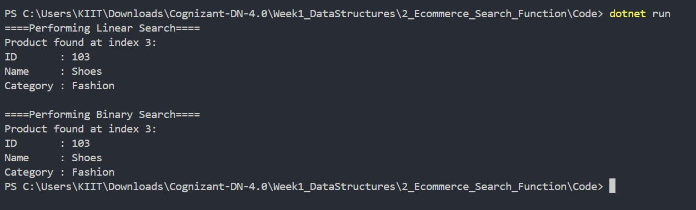

# Exercise 2: E-commerce Platform Search Function

## 👨‍💻 Developer Info
- **Name**: Dhruv Kushwaha  
- **Assignment**: Cognizant Digital Nurture 4.0  
- **Skill**: Data Structures and Algorithms  
- **Week**: 1

---

## 🧠 Problem Statement
You are working on the search functionality of an e-commerce platform.  
The search needs to be optimized for **fast performance**.

---

## ✅ Objectives

- Implement **Linear Search** and **Binary Search** on a list of products.
- Understand and apply **asymptotic notation (Big O)**.
- Compare performance of both search algorithms.

---

## 🏗️ Implementation Details

### 👨‍🔧 Class Used
- `Product`: productId, productName, category

### 🔎 Features
- `LinearSearch` method (O(n))
- `BinarySearch` method (O(log n)) on sorted product array

---

## 📊 Time Complexities

| Operation       | Best Case     | Average Case  | Worst Case   |
|----------------|---------------|---------------|--------------|
| Linear Search   | O(1)          | O(n/2)        | O(n)         |
| Binary Search   | O(1)          | O(log n)      | O(log n)     |

> Binary Search is faster for large sorted datasets.

---

## 📸 Output Screenshot

Below is the sample run showing both searches in action:



---

## 🛠️ How to Run

```bash
cd Week1_DataStructures/2_Ecommerce_Search_Function/Code
dotnet run
