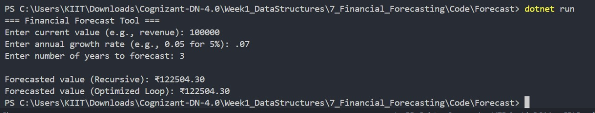

# Exercise 7: Financial Forecasting

## 👨‍💻 Developer Info
- **Name**: Dhruv Kushwaha  
- **Assignment**: Cognizant Digital Nurture 4.0  
- **Skill**: Data Structures and Algorithms  
- **Week**: 1

---

## 🧠 Problem Statement
You are developing a financial forecasting tool that predicts future values based on past data.  
The solution should use recursion to simulate compounded growth over time.

---

## ✅ Objectives

- Implement a **recursive algorithm** to forecast future value.
- Apply **time complexity analysis** for recursion.
- Provide an **optimized loop-based version** to reduce overhead.

---

## 🏗️ Implementation Details

### 👨‍🔧 Method Used
- `ForecastValue(currentValue, growthRate, years)` – Recursive
- `ForecastTail(currentValue, growthRate, years)` – Optimized Iterative

### 📈 Sample Use Case
- Predict future revenue, investment, or cost given a fixed growth rate over time.

---

## 📊 Time Complexities

| Version        | Time Complexity | Notes                            |
|----------------|------------------|----------------------------------|
| Recursive      | O(n)             | One recursive call per year      |
| Optimized Loop | O(n)             | No stack overhead                |

> Recursive is readable; loop is safer for large `n`.

---

## 📸 Output Screenshot

Below is the sample run showing recursive and optimized forecasting:



---

## 🛠️ How to Run

```bash
cd Week1_DataStructures/7_Financial_Forecasting/Code/Forecast
dotnet run
