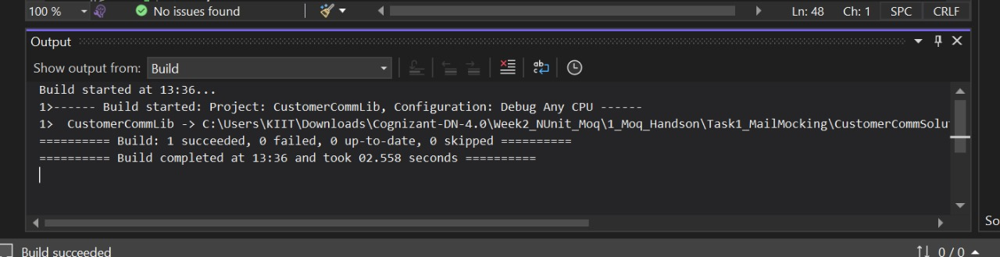
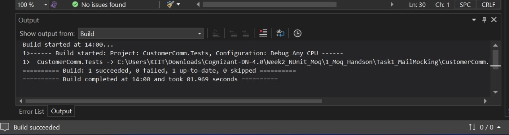
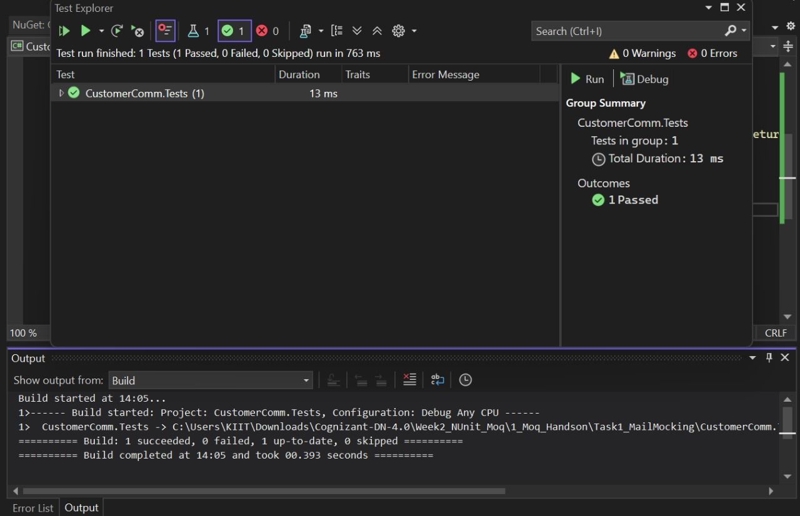

# Task 1: Mail Sender Mocking (CustomerCommLib)

## 📌 Objective
To demonstrate how to write testable code by mocking external email sending functionality using Moq and NUnit.

## 🛠️ Tech Stack
- .NET 6 / .NET Framework
- C#
- NUnit
- Moq

## 📁 Project Structure
CustomerCommSolution/
├── CustomerCommLib/
│ └── MailSender.cs
├── CustomerComm.Tests/
│ └── CustomerCommTests.cs

## 📸 Output Screenshots
## For Build CustomerCommLib and CustomerCommTests

## 📸 Output Screenshots
## For Build CustomerCommTests

## 📸 Output Screenshots
## OF Test Explorer

## 🧪 Description

- The `MailSender` class simulates sending an email using `SmtpClient`.
- It implements the `IMailSender` interface.
- `CustomerComm` depends on `IMailSender`, injected via constructor.
- The test project `CustomerComm.Tests` mocks `IMailSender` using Moq to avoid sending real emails.

## ✅ Test Logic

- Mock returns `true` for any email and message.
- Asserts that `CustomerComm.SendMailToCustomer()` returns `true`.

## 🚀 How to Run Tests

1. Open solution in Visual Studio.
2. Restore NuGet packages (`NUnit`, `Moq`, `NUnit3TestAdapter`).
3. Build the solution.
4. Open **Test Explorer** → Click **Run All**.