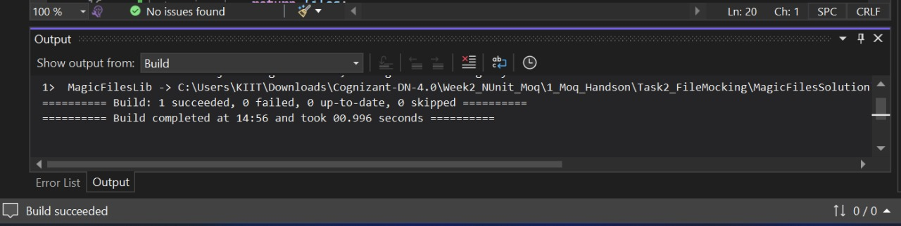
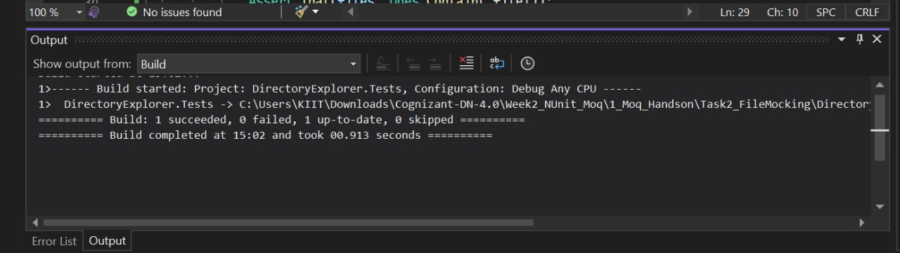
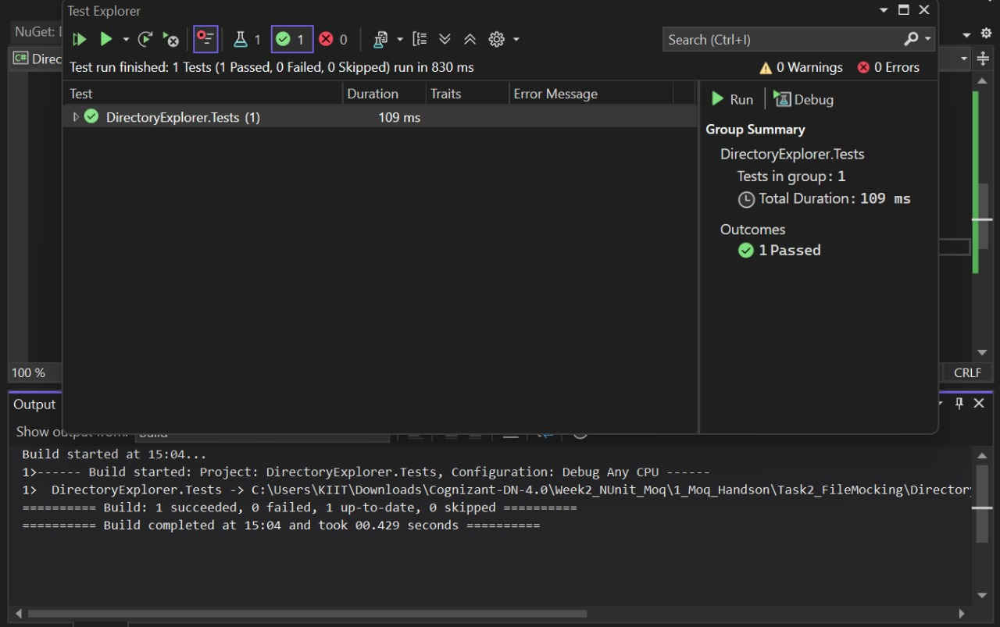

# Task 2: File System Mocking (MagicFilesLib)

## 📌 Objective
To demonstrate unit testing of file-system-dependent logic using Moq by mocking `Directory.GetFiles()` behavior.

## 🛠️ Tech Stack
- .NET 6 / .NET Framework
- C#
- NUnit
- Moq

## 📁 Project Structure
MagicFilesSolution/
├── MagicFilesLib/
│ └── DirectoryExplorer.cs
├── DirectoryExplorer.Tests/
│ └── DirectoryExplorerTests.cs

## 📸 Output Screenshots
## For Build MagicFilesLib

## 📸 Output Screenshots
## For Build DirectoryExplorer

## 📸 Output Screenshots
## OF Test Explorer

## 🧪 Description

- `DirectoryExplorer` implements `IDirectoryExplorer` which defines `GetFiles(string path)`.
- Instead of using static `Directory.GetFiles()`, it's wrapped for testability.
- Unit test mocks `IDirectoryExplorer` to return custom file list.

## ✅ Test Logic

- Asserts:
  - Returned collection is **not null**.
  - Count is **2**.
  - Contains file named `"file.txt"`.

## 🚀 How to Run Tests

1. Open solution in Visual Studio.
2. Restore NuGet packages (`NUnit`, `Moq`, `NUnit3TestAdapter`).
3. Build the solution.
4. Open **Test Explorer** → Click **Run All**.