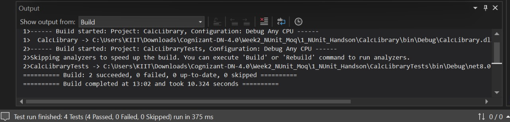

# 🧪 Week 2 – NUnit Hands-on: Unit Testing with Calculator

## 👨‍💻 Developer Info
- **Name**: Dhruv Kushwaha  
- **Program**: Cognizant Digital Nurture 4.0  
- **Week**: 2  
- **Module**: NUnit Testing – C#

---

## 🎯 Objective

To understand and implement **Unit Testing** using the NUnit framework in C# by testing a simple `Calculator` class.

---

## 🧠 Key Concepts Practiced

- ✅ Unit Testing vs Functional Testing  
- ✅ NUnit attributes: `[TestFixture]`, `[Test]`, `[SetUp]`, `[TearDown]`, `[TestCase]`  
- ✅ Writing testable, loosely-coupled code  
- ✅ Using `Assert.That` for result validation  

---

## 🛠️ Technologies Used

- Visual Studio 2022 (.NET Desktop Development)
- NUnit Framework
- Moq (for mocking dependencies in future tasks)
- C#

---

## 📂 Folder Structure

1_NUnit_Handson/
├── CalcLibrary/ # Contains Calculator logic
├── CalcLibraryTests/ # NUnit tests for Calculator
├── Output/ # Contains screenshot of test result
│ └── test-result.png
└── README.md # This file

---

## ▶️ How to Run

1. Open the `.sln` file in **Visual Studio 2022**.
2. Build the solution (`Ctrl + Shift + B`) – ensure both projects build successfully.
3. Go to `Test` > `Test Explorer`.
4. Run All Tests – confirm green checkmarks for passing tests.

---

## ✅ Output

---

## 📌 Notes

- You can extend the Calculator class to include more operations like Subtraction, Multiplication, etc.
- The test cases use `[TestCase]` for parameterized testing.