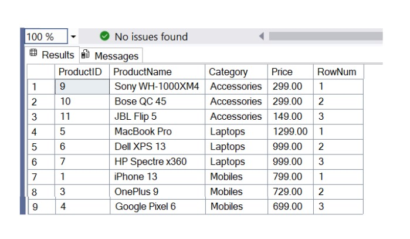
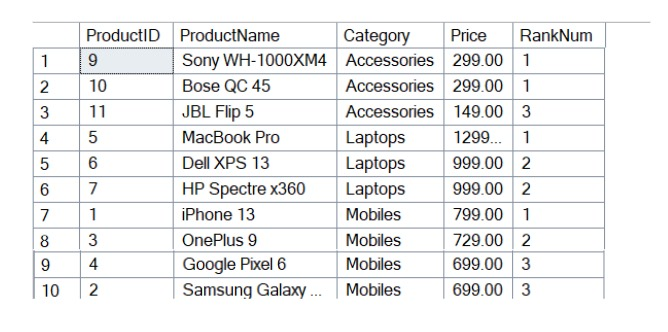
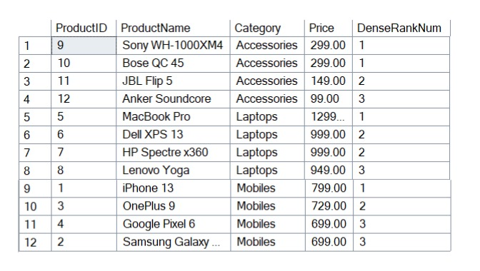

# Exercise 1: Ranking and Window Functions

## 👨‍💻 Developer Info
- **Name**: Dhruv Kushwaha  
- **Assignment**: Cognizant Digital Nurture 4.0  
- **Skill**: SQL – Advanced  
- **Week**: 2

---

## 🧠 Problem Statement

You are required to find the **top 3 most expensive products** in each category using SQL window functions.

---

## ✅ Objectives

- Use **ROW_NUMBER(), RANK(), DENSE_RANK()**  
- Understand how **PARTITION BY** and **ORDER BY** affect result sets  
- Compare different ranking strategies

---

## 🏗️ Implementation Details

### 👨‍🔧 Table Used
- `Products`: with columns `ProductID`, `ProductName`, `Category`, `Price`

### 🔢 Ranking Functions Used
- `ROW_NUMBER()` — gives a unique rank
- `RANK()` — allows gaps in ranks for ties
- `DENSE_RANK()` — no gaps for ties

---

## 📊 Time Complexities

| Function      | Use Case                      |
|---------------|-------------------------------|
| ROW_NUMBER    | Unique sequential ranking      |
| RANK          | Ranking with ties (gaps exist) |
| DENSE_RANK    | Ranking with ties (no gaps)    |

---

## 📸 Output Screenshots

**ROW_NUMBER:**



**RANK:**



**DENSE_RANK:**



---

## 🛠️ How to Run

### Step 1: Create and Populate Table

```sql
DROP TABLE IF EXISTS Products;

CREATE TABLE Products (
    ProductID INT PRIMARY KEY,
    ProductName VARCHAR(100),
    Category VARCHAR(50),
    Price DECIMAL(10, 2)
);

INSERT INTO Products VALUES
(1, 'iPhone 13', 'Mobiles', 799),
(2, 'Samsung Galaxy S21', 'Mobiles', 699),
(3, 'OnePlus 9', 'Mobiles', 729),
(4, 'Google Pixel 6', 'Mobiles', 699),
(5, 'MacBook Pro', 'Laptops', 1299),
(6, 'Dell XPS 13', 'Laptops', 999),
(7, 'HP Spectre x360', 'Laptops', 999),
(8, 'Lenovo Yoga', 'Laptops', 949),
(9, 'Sony WH-1000XM4', 'Accessories', 299),
(10, 'Bose QC 45', 'Accessories', 299),
(11, 'JBL Flip 5', 'Accessories', 149),
(12, 'Anker Soundcore', 'Accessories', 99);

-- ROW_NUMBER Query
SELECT *
FROM (
    SELECT *,
           ROW_NUMBER() OVER (PARTITION BY Category ORDER BY Price DESC) AS RowNum
    FROM Products
) AS Ranked
WHERE RowNum <= 3;

-- RANK Query
SELECT *
FROM (
    SELECT *,
           RANK() OVER (PARTITION BY Category ORDER BY Price DESC) AS RankNum
    FROM Products
) AS Ranked
WHERE RankNum <= 3;

-- DENSE_RANK Query
SELECT *
FROM (
    SELECT *,
           DENSE_RANK() OVER (PARTITION BY Category ORDER BY Price DESC) AS DenseRankNum
    FROM Products
) AS Ranked
WHERE DenseRankNum <= 3;
