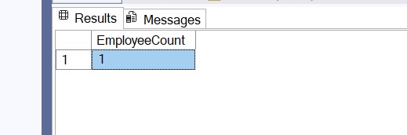

# Exercise 5: Return Data from a Stored Procedure

## 👨‍💻 Developer Info
- **Name**: Dhruv Kushwaha  
- **Assignment**: Cognizant Digital Nurture 4.0  
- **Skill**: SQL – Stored Procedures  
- **Week**: 2

---

## 🧠 Problem Statement

You are required to create a **stored procedure** that returns the **total number of employees** in a given department.

---

## ✅ Objectives

- Use `COUNT()` aggregate function
- Create a stored procedure with input parameter
- Return count based on the specified `DepartmentID`

---

## 🏗️ Table Schema

### 🔸 Departments

| Column         | Type         |
|----------------|--------------|
| DepartmentID   | INT (PK)     |
| DepartmentName | VARCHAR(100) |

### 🔸 Employees

| Column       | Type               |
|--------------|--------------------|
| EmployeeID   | INT (PK, Identity) |
| FirstName    | VARCHAR(50)        |
| LastName     | VARCHAR(50)        |
| DepartmentID | INT (FK)           |
| Salary       | DECIMAL(10,2)      |
| JoinDate     | DATE               |

---


## 🛠️ How to Run

### 📍 Setup Instructions:
1. Open **SQL Server Management Studio (SSMS)**.
2. Select or create a database named `EmployeeDB`.
3. Copy and run the script from [`employee_count_procedure.sql`](./employee_count_procedure.sql) to:
   - Create tables
   - Insert sample data
   - Define stored procedures

### ▶️ To Test Execution:
Run the following queries in SSMS after setup:

```sql
EXEC sp_GetEmployeeCountByDepartment @DepartmentID = 2;