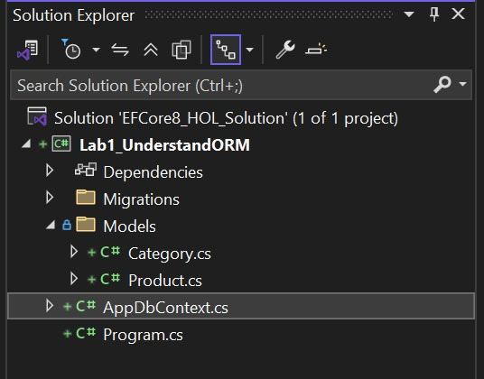
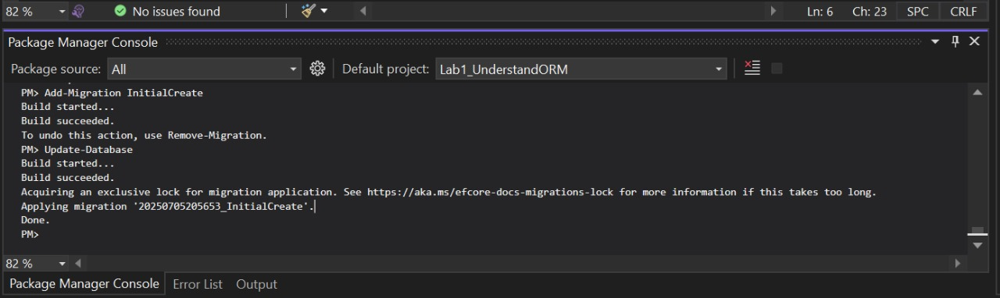
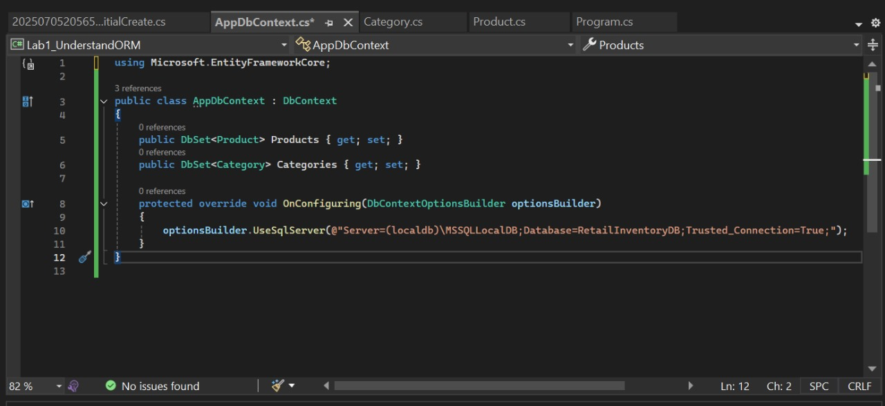
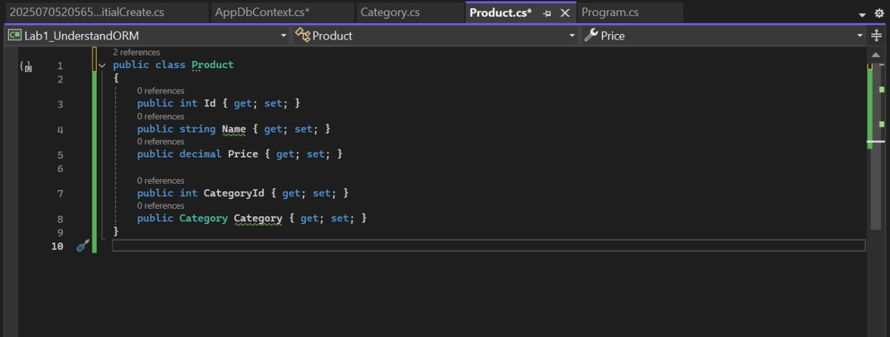
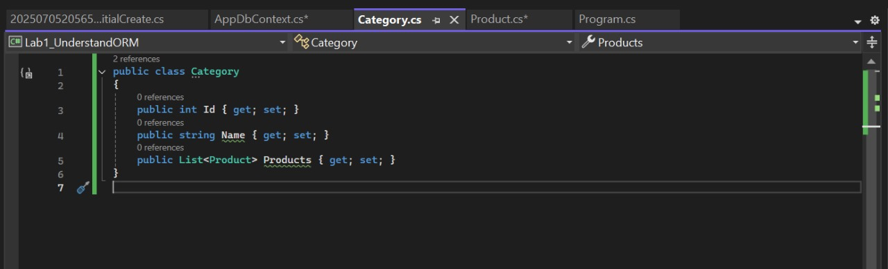

# Lab 1: Understanding ORM with a Retail Inventory System

**Name:** Dhruv Kushwaha  
**SuperSet ID:** 6363396

## 🔍 Objective
To understand Object-Relational Mapping (ORM) using Entity Framework Core 8.0 and how it bridges C# objects with SQL Server database tables.

## 💡 What is ORM?
ORM maps C# classes (like `Product` and `Category`) to relational tables in a database. It automates SQL generation and reduces boilerplate code.

### ✅ Benefits of ORM:
- Increases developer **productivity**
- Enhances **maintainability**
- Abstracts direct **SQL usage**
- Enables rich LINQ queries

## 🆚 EF Core vs EF Framework
| EF Core                         | EF Framework (EF6)         |
|--------------------------------|----------------------------|
| Cross-platform                 | Windows-only               |
| Lightweight                    | Mature but bulky           |
| Supports LINQ, Async, etc.     | Limited async support      |
| Modern (supports .NET 6/7/8)   | Legacy (.NET Framework)    |

## 🚀 EF Core 8.0 Features
- JSON column mapping
- Improved performance via compiled models
- Interceptors and bulk operations

## 🏗️ What I Did
- Created a console app `Lab1_UnderstandORM`
- Installed EF Core packages
- Created `Product` and `Category` model classes
- Created `AppDbContext` to configure DB access

## 📂 Folder Structure
Week3_EntityFramework/
└── EFCore8_HOL/
└── Lab1_UnderstandORM/
├── Models/
│ ├── Product.cs
│ └── Category.cs
├── AppDbContext.cs
└── Program.cs

## 📸 Output Screenshots
## For Solution Explorer

## 📸 Output Screenshots
## For Package Manager Console

## 📸 Output Screenshots
## For AppDbContext.cs

## 📸 Output Screenshots
## OF Product.cs

## 📸 Output Screenshots
## OF Category.cs
