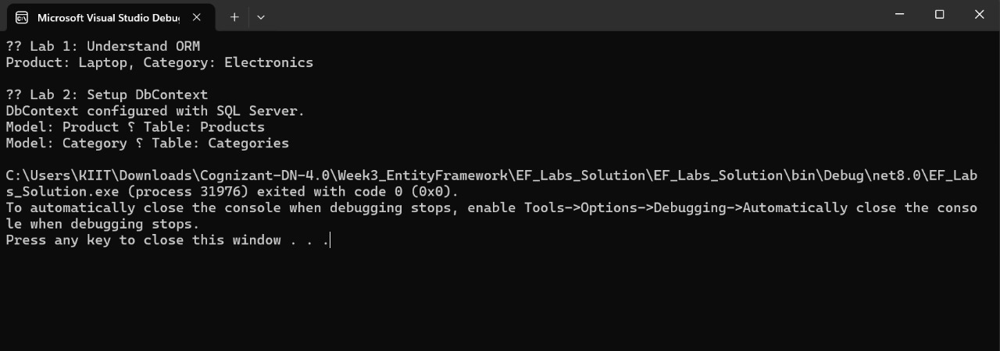

# Lab 1: Understanding ORM with a Retail Inventory System  
**Name:** Dhruv Kushwaha  
**SuperSet ID:** 6363396  

---

🔍 **Objective**  
To understand Object-Relational Mapping (ORM) using Entity Framework Core 8.0 and how it bridges C# objects with SQL Server database tables.

---

💡 **Scenario**  
You are building an inventory system for a retail store that tracks product categories and stock levels using EF Core.

---

📝 **Theory**

### What is ORM?
ORM is a programming technique for converting data between incompatible systems — such as objects in C# and relational databases.ORM maps C# classes (like Product and Category) to relational tables in a database. It automates SQL generation and reduces boilerplate code.

### Benefits:
Increases developer productivity
Enhances maintainability
Abstracts direct SQL usage
Enables rich LINQ queries

### EF Core vs EF Framework:
- EF Core: Lightweight, modern, cross-platform  
- EF Framework: Mature, Windows-only, limited flexibility

### EF Core 8.0 Features:
- JSON column mapping  
- Compiled models for performance  
- Interceptors and enhanced bulk operations

---

🧪 **Steps Performed**
- Created a new .NET console application  
- Installed EF Core packages  
- Created `Product` and `Category` classes  
- Simulated object-to-object relationship using in-memory data

---

🖥️ **Output**

**Result**  
Demonstrated how EF Core can be used to represent relational data structures through C# classes.