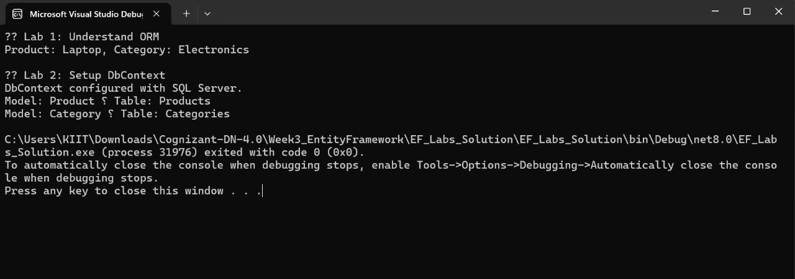

# Lab 2: Setting Up the Database Context for a Retail Store  
**Name:** Dhruv Kushwaha  
**SuperSet ID:** 6363396  

---

**Objective**  
Configure EF Core's `DbContext` to connect C# models to a SQL Server database.

---

**Scenario**  
The retail store wants a persistent database to store categories and products. EF Core's `DbContext` is used to define this mapping.

---

**Theory**

### What is DbContext?
`DbContext` represents a session with the database, used to query and save data. It contains `DbSet` properties that map to tables.

---

**Steps Performed**
- Created an `AppDbContext` class  
- Registered `Products` and `Categories` as `DbSet`s  
- Configured SQL Server connection string using `UseSqlServer()`  
- Verified context creation in the console

---

**Output**

**Result**  
Successfully set up `AppDbContext` to connect EF Core models with SQL Server database tables.