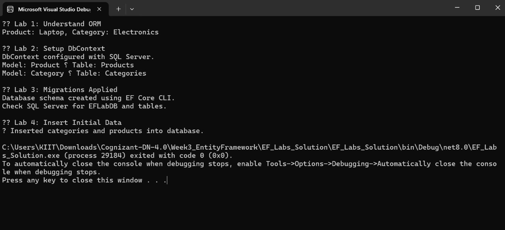

# Lab 3: Using EF Core CLI to Create and Apply Migrations  
**Name:** Dhruv Kushwaha  
**SuperSet ID:** 6363396  

---

**Objective**  
Generate a database schema from C# models using EF Core CLI migrations.

---

**Scenario**  
Instead of manually creating tables, EF Core provides a migration mechanism to sync models with the database.

---

**Theory**

### What are Migrations?
Migrations are code-based changes that evolve the database schema over time based on your models.

---

**Steps Performed**
- Installed `dotnet-ef` tool globally  
- Created an initial migration using `Add-Migration`  
- Applied the migration using `Update-Database`  
- Verified table creation in SQL Server (`Products`, `Categories`)

---

**Output**

**Result**  
EF Core successfully created and applied the migration to generate the database schema from defined models.