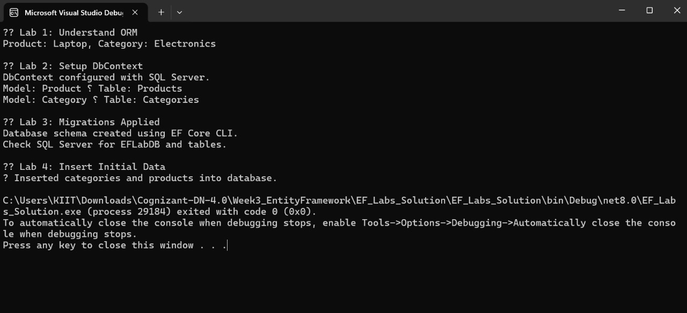

# Lab 4: Inserting Initial Data into the Database  
**Name:** Dhruv Kushwaha  
**SuperSet ID:** 6363396  

---

**Objective**  
Insert initial product and category data into SQL Server using async EF Core methods.

---

**Scenario**  
The store manager wants to add basic inventory data to the system: two categories and related products.

---

**Theory**

### Key EF Core Methods:
- `AddRangeAsync()`: Adds multiple records  
- `SaveChangesAsync()`: Persists changes to the database

---

**Steps Performed**
- Created two `Category` objects: Electronics and Groceries  
- Created two `Product` objects linked to those categories  
- Used async methods to insert data into the database  
- Verified insertion in SQL Server

---

**Output**

**Result**  
Initial product and category data was successfully inserted and persisted in the SQL Server database.