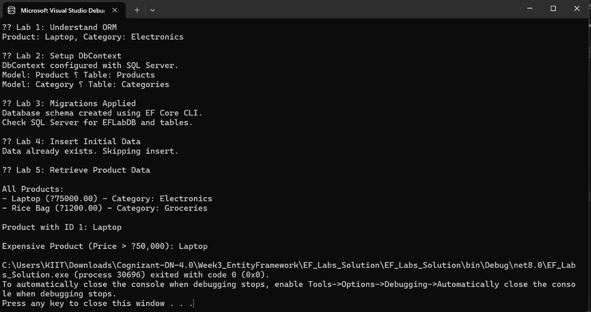

# Lab 5: Retrieving Data from the Database  
**Name:** Dhruv Kushwaha  
**SuperSet ID:** 6363396  

---

**Objective**  
Use EF Core LINQ and async queries to retrieve product data from the database.

---

 **Scenario**  
The system must fetch and display products for the store dashboard. Queries include all products, a specific product by ID, and a filter by price.

---

 **Theory**

### Common EF Core Retrieval Methods:
- `ToListAsync()`: Gets all records  
- `FindAsync()`: Fetches by primary key  
- `FirstOrDefaultAsync()`: Returns the first record matching a condition

---

 **Steps Performed**
- Retrieved all products and printed names with prices  
- Used `FindAsync` to locate a product by ID  
- Used `FirstOrDefaultAsync` to find an expensive product (Price > ₹50,000)

---

 **Output**

**Result**  
Successfully retrieved and filtered data using EF Core async LINQ queries.